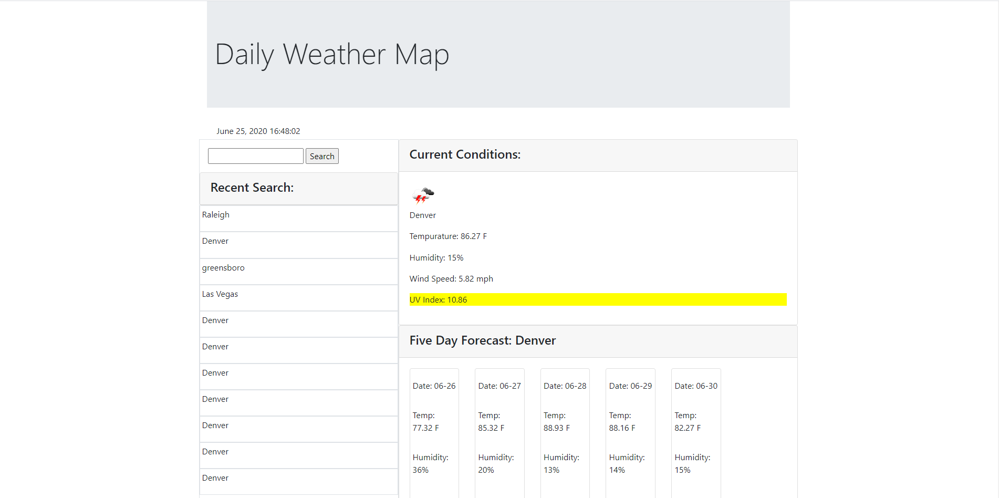

# weather_map

With this application, the user will input a city into the search box.  The page will then display the current weather conditions in addition to a five day forcast on the page.  The users recent searches will be available below the search box.

I used jquery, javascript, html, and css to create this file.  Using my experience with for loops from my previous assignment I used jquery to dynamically generate the HTML on the page while accessing the data within the API.  One of the more challenging aspects of the assignment is the API.  Not all API's are the same, both in content and in use, so learning to navigate that world made getting started a little challenging.  Once the api's were up and running previous homeworks and class assignments filled in the rest.  

Partial credit is owed to my classmates who met with me outside of class hours several times to work on this assignment together.  We gained a lot of expereince in group de-bugging.

I am still struggling with the search history printing results back to the page.

