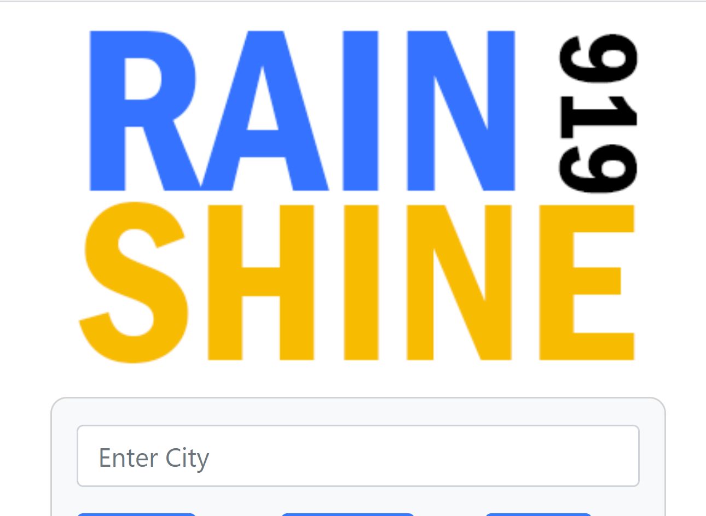

# [Daily Weather Map](https://diuguide.github.io/weather_map/)


[](LICENSE)
[](code_of_conduct.md)

An [API based weather app](https://diuguide.github.io/weather_map/) that allows the user view current conditions and a five day forecast.

<a href="https://diuguide.github.io/weather_map/">

</a>


## Table of Contents

- [Installation](#installation)
- [Usage](#usage)
- [Contributing](#contributing)
- [Questions](#questions)
- [License](#license)

## Installation

If you want to set up your own instance of this app, please follow the following steps.

1. clone this repository using either **ssh**...

```terminal
git clone git@github.com:diuguide/weather_map.git
```

...or clone using **https**.

```terminal
git clone https://github.com/diuguide/weather_map.git
```

2. Deploy to GitHub.

[back to Table of Contents](#table-of-contents)

## Usage

To use the app, navigate to <https://diuguide.github.io/weather_map/> please follow the following steps.

1. Enter a city or town in the search bar on the left.

1. Click the ```Search``` button.  The current conditions in addition to a five day forecast will be populated to the right.

1. Recent search queries will be listed below the search bar, the user may access those searches by clicking the ```City or Town``` they previously serached.


[back to Table of Contents](#table-of-contents)

## Contributing

Your contribution is most welcome! Please refer to the contributing guidelines when making contributions to this project.

Please note that this project is released with a [Contributor Code of Conduct](code_of_conduct.md). By Participating in this project, you agree to abide by its terms.

[back to Table of Contents](#table-of-contents)


## Questions

Please reach out to me @ ```everett.diuguid@gmail.com``` with any questions regarding this project.

[back to Table of Contents](#table-of-contents)


## License

[MIT](LICENSE) copyright (c) 2020 Everett Diuguid.

[back to Table of Contents](#table-of-contents)